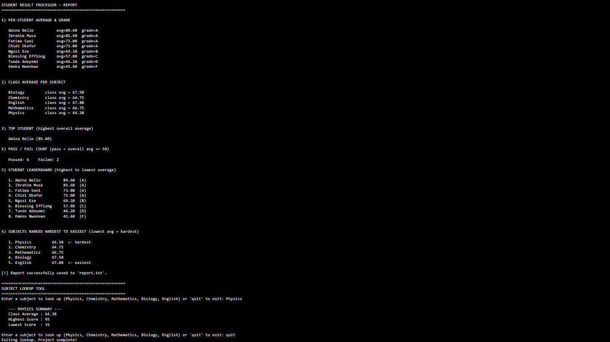

# Student Result Processor

## Description
The Student Result Processor is a pure Python command-line tool designed to analyze raw exam data from a CSV file. Without relying on external data libraries like pandas, the program reads the dataset, calculates per-student averages and assigns letter grades based on a predefined scale. It also generates a comprehensive class report that includes pass/fail metrics, a ranked student leaderboard, a subject difficulty ranking (from hardest to easiest), and an interactive lookup tool for individual subject statistics.

## Output Screenshot

## Written Analysis
The overall pass rate of 75% (6 out of 8 students passing) indicates that the majority of the class is grasping the material, though there is a wide spread in individual performance. Physics is currently the class's weakest subject with an average of 64.38, suggesting that the instructor may need to review this curriculum or provide additional group support. Conversely, English is the strongest subject, and Amina Bello stands out as the clear top performer with a dominant 89.60 overall average. However, two students—Tunde Adeyemi and Emeka Nwankwo—failed the term with averages dropping below 50; these students are highly at-risk and require immediate academic intervention.
